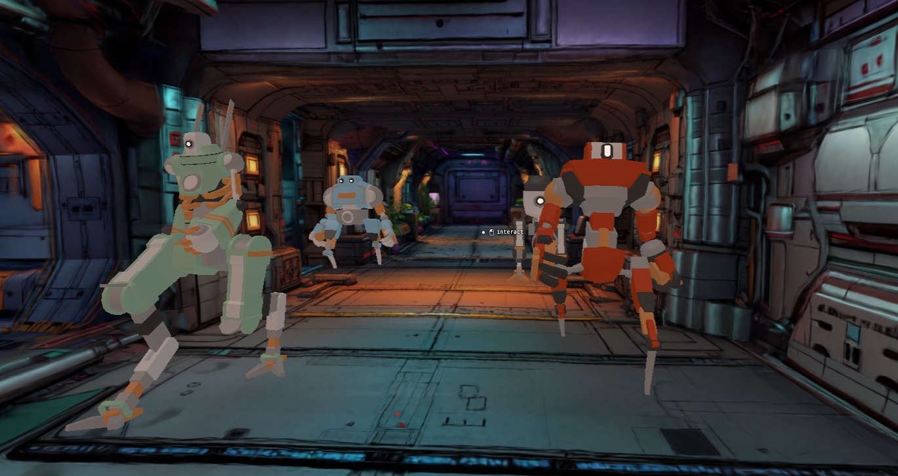

<p align="center">
  
</p>

# clingy-space-friends

A walkable Gaussian-splat spaceship: explore a cozy ship interior in first person, with a little crowd of companions that follow you around and play emotes when you interact with them. Rendered with [Spark](https://github.com/sparkjsdev/spark) in the browser. Use it as a starter for your own interactive splat worlds.

## Stack

| Layer | Library |
| --- | --- |
| Renderer | [Three.js](https://threejs.org) (`WebGLRenderer`) |
| Gaussian splats | [Spark](https://github.com/sparkjsdev/spark) (`SparkRenderer` with streaming LOD `.rad`) |
| Physics & character controller | [crashcat](https://www.npmjs.com/package/crashcat) (static triangle-mesh collider, kinematic character controller, raycasts) |
| Navigation | [navcat](https://www.npmjs.com/package/navcat) (solo navmesh and crowd steering/avoidance) |
| Math | [mathcat](https://www.npmjs.com/package/mathcat) |
| Binary asset packing | [packcat](https://www.npmjs.com/package/packcat) (the collider `.bin` schema) |
| Asset tooling | [glTF-Transform](https://gltf-transform.dev) (collider/navmesh extraction), [Playwright](https://playwright.dev) (headed light-probe bake) |
| Language and build | TypeScript with [Vite](https://vite.dev) |
| Lint and format | [Biome](https://biomejs.dev) |

## Quick start

### Requirements

- Node.js 24+ (see `.nvmrc`).
- pnpm (the repo ships a `pnpm-lock.yaml`).
- Google Chrome, only for re-baking the light probes (`pnpm bake:probes` drives real headed Chrome). Not needed to run the scene.

### Install and run

```bash
pnpm install
pnpm dev          # http://localhost:5173
```

### Build for production

```bash
pnpm build        # tsc + vite build, output to dist/
pnpm preview      # serve the production build locally
```

## Controls

- **Move**: `W` `A` `S` `D` / arrow keys
- **Look**: mouse (click the canvas to capture the pointer)
- **Jump**: `Space`
- **Sprint**: hold `Shift`
- **Interact**: walk up to a companion and **left-click**. The crosshair shows a mouse "interact" hint when one is in range (~2 m). Clicking makes them play a random emote (`Yes`, `No`, or `Dance`), then blend back.
- **Debug panel**: backtick (`` ` ``)
- **Bake light probes in-app**: `B` (the offline `pnpm bake:probes` is what produces the committed grid)

## How it works

A Gaussian splat is only visuals: a cloud of coloured blobs, with no floor, walls, or sense of which blobs are solid. The interactive parts come from invisible data aligned with the splat.

**Collider** (`src/physics.ts`, `src/collider-schema.ts`). A static triangle mesh of the ship's hull and floors. [crashcat](https://www.npmjs.com/package/crashcat) uses it for the player's swept capsule collisions, and the interaction ray casts against it so a wall between you and a companion blocks the interaction.

**Character controller** (`src/character.ts`, `src/controls.ts`). The player is a crashcat kinematic character controller (KCC) capsule with Quake-style movement (ground friction, air-strafe acceleration, bunny-hopping), plus pointer-lock mouse look and a subtle view bob that leans into a run.

**Navmesh** (`src/navigation.ts`). A navigation mesh over the walkable floor that [navcat](https://www.npmjs.com/package/navcat) uses for path-finding and crowd steering.

**Crowd** (`src/characters.ts`). The companions are navcat crowd agents that follow the player and avoid each other. The player is *also* a crowd agent (a target-less proxy pinned to your feet each frame), so the companions steer around you like any other obstacle.

**Companions** (`src/character-visuals.ts`). Draws an animated model per companion, blending idle and walk by speed and facing the direction of travel. Interactions crossfade in a one-shot emote clip and blend back out when it ends.

**Interaction** (`src/view-ray.ts`, `src/crosshair.ts`). Each companion has a kinematic capsule that follows it, used only as a raycast target. A ray from the camera resolves the closest hit back to a character via a body→character map in `physics.ts`. If it lands on a companion in range, the crosshair shows the hint and a left-click triggers the emote.

The collider, navmesh, and probe grid are "baked": generated once, offline, then saved as small files the browser loads directly (see [Asset pipeline](#asset-pipeline)). A loading overlay stays up until enough of the splat is on screen (it counts drawn splats rather than waiting a fixed time).

## Asset pipeline

Everything the browser loads is baked offline, so there's no heavy parsing at runtime. The hand-authored collision mesh `assets/colliders.glb` is the shared source for both the runtime collider and the navmesh. The light-probe grid is baked from the ship splat itself.

```bash
pnpm build:collider   # public/collider.bin       from assets/colliders.glb
pnpm build:navmesh    # public/navmesh.json        from assets/colliders.glb
pnpm bake:probes      # public/light-probes.json   from the ship splat (via src/bake.ts)
```

| Script | Input | Output | Used by |
| --- | --- | --- | --- |
| [`scripts/build-collider.ts`](scripts/build-collider.ts) | `assets/colliders.glb` | `public/collider.bin` | `src/collider-schema.ts`, then `src/physics.ts` |
| [`scripts/build-navmesh.ts`](scripts/build-navmesh.ts) | `assets/colliders.glb` | `public/navmesh.json` | `src/navigation.ts` |
| [`scripts/bake-probes.mjs`](scripts/bake-probes.mjs) | ship splat (`bake.html` → `src/bake.ts`) | `public/light-probes.json` | `src/light-probes.ts` |

The collider is packed to a compact binary with [packcat](https://www.npmjs.com/package/packcat), storing just positions and triangle indices. `src/collider-schema.ts` is the shared pack/unpack schema. `build-navmesh` also flood-fill-prunes the navmesh from a seed point, so only the one connected walkable volume the player occupies is saved. Disconnected islands and the exterior hull shell are dropped.

The probe bake spins up the Vite dev server, opens `bake.html` in **real headed Chrome**, because Spark needs a real GPU and headless Chromium renders splats faithlessly. It then captures the SH grid the page computes and writes the JSON. Re-run it whenever the ship splat or the `PROBE_*` grid config in `src/scene.ts` changes.

> The runtime splat (`public/spaceship-lod.rad`) is a streaming-LOD `.rad` built from the source `.spz` with Spark's `build-lod` tool. That step isn't wired up as a script in this repo. The prebuilt `.rad` ships in `public/`.

## Scene configuration

Everything specific to *this* ship's geometry and layout (asset URLs, camera/spawn positions, the light-probe grid extents, gravity, lighting intensities) lives in [`src/scene.ts`](src/scene.ts), so swapping in a new world is largely a one-file edit. Per-system "feel" constants (movement, bob, follow distances) stay in their own modules.

## Debug panel

Press backtick (`` ` ``) for a debug overlay with a live readout (camera/feet position, splat counts) and toggles:

- **orbit camera**: swap the first-person controller for an orbit camera
- **collider debug**: the static collision triangle mesh (built once)
- **navmesh debug**: the walkable navmesh
- **light probes**: the baked probe grid, each shown as an SH-shaded gizmo sphere
- **crowd debug**: a cylinder per crowd agent (companions and the player proxy)
- **lod scale**: a slider on the splat level-of-detail budget

## Deploy (GitHub Pages)

`vite.config.ts` reads a `BASE_PATH` env var (default `/`). To serve under a project subpath, build with it set (e.g. `BASE_PATH=/clingy-space-friends/ pnpm build`), so the app and its absolute asset URLs (via `import.meta.env.BASE_URL` in `src/scene.ts`) resolve correctly. Update the value if you rename the repo.

## License

MIT.
